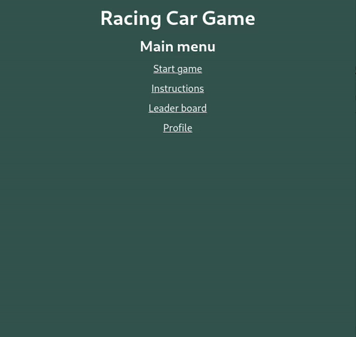

# Racing Car Game

A mini racing car game built using JavaScript, React, Go and PostgreSQL

## Demo

**Link:** https://racing-car-game.pages.dev/

## Lessons Learned

By doing this project I've learned

- How to use [Canvas Api](https://developer.mozilla.org/en-US/docs/Web/API/Canvas_API) to render game logic
- How to perform database migrations using [goose](https://pressly.github.io/goose/)
- How to perform database CRUD operations using SQL
- How to use [sqlc](https://sqlc.dev/) to generate type-safe code from SQL
- How to build REST API using [Go](https://go.dev/) and [chi router](https://go-chi.io/)
- How to authenticate and authorize users using JWT

## Repositories

- [Frontend](https://github.com/VMadhuranga/racing-car-game-frontend)
- [Backend](https://github.com/VMadhuranga/racing-car-game-backend)

## Acknowledgements

- [OpenGameArt.Org](https://opengameart.org/) free online repository of digital assets for video game development
- [Racing Car](https://opengameart.org/content/racing-car-0) by [awesomeduck](https://opengameart.org/users/awesomeduck) licensed [CC0 1.0](https://creativecommons.org/publicdomain/zero/1.0/)
- [Loaders](https://cssloaders.github.io/): collection of different types of CSS loaders, spinners.

## Known Issues

- This application's server is deployed on a free tier with limited resources. Free server instance will spin down with inactivity. When that happens, it might take some time to spin up the server instance.
